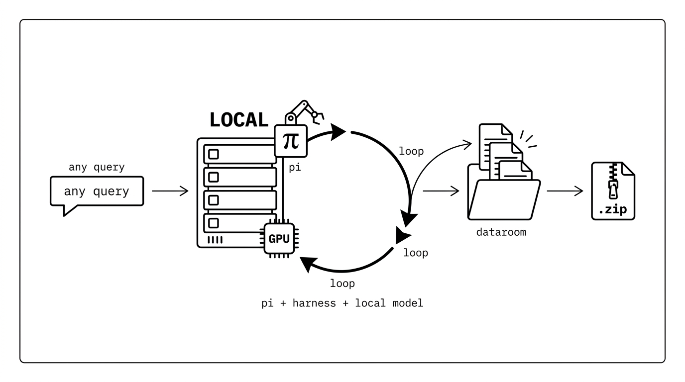
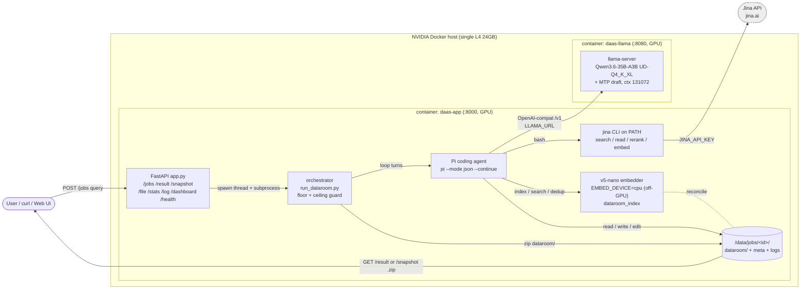

# Dataroom

Give it a query. A local model in a [Pi](https://pi.dev) harness loops search-read-write until it has built a comprehensive, fully-cited **dataroom** on disk - a `.zip` you hand to a frontier model for the long-horizon task.

<p align="center">
  
</p>

<p align="center">
  <b>Live demo → <a href="https://dataroom.hanxiao.io">dataroom.hanxiao.io</a></b>
</p>

## Why

[For long-horizon task you need a grounded, well-organized knowledge dump before the real work can start.](https://x.com/hxiao/status/2044765001370701981?s=20) That upfront research is mostly a search-read-write loop, and few things are usually wrong with how it gets done today.

- **Research is mechanical, so don't pay frontier tokens for it.** Gathering and organizing sources is tool-calling, not deep reasoning - a small local model in a disciplined harness (search, dedup, cite, verify) does it fine. And because it runs on your own GPU at near-zero marginal token cost, it can keep going for hours until the dataroom is actually comprehensive, instead of stopping when a metered budget runs out.
- **The output is context for a machine, not a report for a human.** A 2025-style deep-research run ends in a long PDF nobody reads. Dataroom ends in a structured `.zip` - `topics/`, `sources/`, `data/`, a `SUMMARY.md`, every claim cited - built to be consumed by the next agent, not skimmed.
- **It is stage one of a two-stage pipeline.** Unzip the dataroom into a frontier model's context and let it do the expensive second stage (usually implementation). The research does not have to be perfect - its consumer is intelligent and can spot gaps - it has to be comprehensive and grounded.

Everything runs locally on your own GPU: the model is self-hosted (llama.cpp), and the only thing that leaves the box is the web search/read the agent chooses to do.

## How it works

<p align="center">
  
</p>

Submit a query and an async job spins up a headless Pi coding agent backed by a self-hosted Qwen3.6-35B-A3B (llama.cpp). The agent runs its own research loop: `pi --mode json --continue` resumes the same per-cwd session across turns, and on each turn it searches, reads, reranks, and writes sourced files into a `dataroom/` directory on disk.

- Autonomous loop: the agent is not micromanaged. It is handed tools and a one-page methodology, then drives itself - search, read, dedup, write, verify - until the work is done.
- Outcome-based stopping: `DONE` is honored only once the dataroom holds enough substantive sourced files, all sub-questions are closed, and a `SUMMARY.md` exists. Turns / seconds / Jina-call caps are only hard backstops, and a premature `DONE` is rejected so the agent keeps going. The reason it stopped is surfaced on the dashboard.
- jina CLI: the `jina` CLI is on PATH (search / read / rerank / embed / dedup), driven from bash and composable via pipes (`jina search Q | jina rerank R`, `cat urls.txt | jina read`, `xargs -P 8` for parallel fan-out) so bulky intermediates stay out of the LLM context. 
- Embedding dedup index: `jina-embeddings-v5-nano` is preloaded for the dataroom index (embed / semantic search / dedup), with server-side reconciliation so it never drifts from disk. The agent must search the index before adding anything, to avoid duplicates and keep structure.
- Live dashboard: real-time context utilization, throughput, tool-call distribution, live activity feed, warnings/errors, progress-to-floor, a stop-reason banner, and the dataroom file tree, at `GET /jobs/{id}/dashboard`.

The [live dashboard](https://dataroom.hanxiao.io) for a finished job - progress-to-floor, total tokens, tool-call distribution, throughput, the activity feed, and the dataroom file tree:

<p align="center">
  
</p>

## Get Started

An NVIDIA Docker host runs two containers (llama-server + the app). `scripts/setup.sh` installs Docker + the NVIDIA toolkit, downloads the model, and brings the stack up. The only value you must set is `JINA_API_KEY`; everything else in `.env.example` ships with working defaults.

Clone and set the key once:

```bash
git clone https://github.com/hanxiao/dataroom.git
cd dataroom
cp .env.example .env
sed -i 's/^JINA_API_KEY=.*/JINA_API_KEY=jina_your_real_key/' .env
```

### Option A: prebuilt image (fastest)

Pull the published app image from GHCR instead of building it locally (skips the ~14GB build). `setup.sh` still installs Docker + the toolkit and downloads the model, then pulls + starts the stack:

```bash
DAAS_PULL=1 bash scripts/setup.sh
```

Pulls `ghcr.io/hanxiao/dataroom:latest`.

### Option B: build from source

Build the app image locally (no pull). Same one-shot, just slower the first time:

```bash
bash scripts/setup.sh
```

Either way, when it finishes it prints the API URL.

Prereqs:
- An NVIDIA GPU with the driver installed (`nvidia-smi` must work) and the `nvidia-container-toolkit`. `setup.sh` installs the toolkit on Debian/Ubuntu hosts; on RHEL-family hosts install it yourself first. The llama-server needs the GPU; the app's v5-nano embedder runs on CPU by default (`EMBED_DEVICE=cpu`) to leave VRAM for the Q4 model (set `EMBED_DEVICE=cuda` to move it onto the GPU).
- A Jina API key: https://jina.ai/api-dashboard/
- Disk for a ~22GB model download plus the CUDA + pytorch base images and job data under `./data`. The model download alone can take several minutes on a slow link; it resumes from the Hugging Face cache if interrupted.

## Run on Apple Silicon (Mac, no Docker)

No NVIDIA GPU? Dataroom also runs natively on an Apple Silicon Mac, serving the model on **Metal**
via Homebrew's `llama.cpp` — no Docker, no CUDA. The app, Pi agent, and embedder run in a local
`uv` virtualenv; **no application-code changes are needed**.

```bash
brew install llama.cpp
npm install -g @earendil-works/pi-coding-agent@0.78.0
uv venv --python 3.11 .venv
uv pip install --python .venv/bin/python torch -r server/requirements.txt jina-cli huggingface-hub
# download the NON-MTP GGUF (the MTP variant won't load on the Homebrew build — see docs/MAC.md)
HF_TOKEN=hf_... .venv/bin/python -c "from huggingface_hub import hf_hub_download; \
hf_hub_download('unsloth/Qwen3.6-35B-A3B-GGUF','Qwen3.6-35B-A3B-UD-Q4_K_XL.gguf',local_dir='models')"
cp .env.example .env && sed -i '' 's/^JINA_API_KEY=.*/JINA_API_KEY=jina_your_real_key/' .env
bash scripts/mac-run.sh
```

**Full guide, including why the non-MTP GGUF and the Metal flag changes: [`docs/MAC.md`](docs/MAC.md).**
Recommended: 32 GB+ unified memory (the Q4 model wires ~22 GB). The web UI and API below work
identically; just use `localhost`.

## Skill & API usage

### Skill

Another LLM/agent can commission a dataroom from a deployed instance with the `use-dataroom` skill ([`skills/use-dataroom/SKILL.md`](skills/use-dataroom/SKILL.md)): submit a query with a **minutes time-box** (like handing an intern a time-boxed task), poll until it finishes, then download and unzip the result. One-shot:

```bash
BASE="https://dataroom.hanxiao.io"          # the deployed instance
QUERY="Competitive landscape of self-hosted small embedding models in 2026"
MINUTES=30                                  # time box: works up to this long, then hands over

JOB=$(curl -s -X POST "$BASE/jobs" -H 'content-type: application/json' \
  -d "{\"query\": $(python3 -c 'import json,sys;print(json.dumps(sys.argv[1]))' "$QUERY"), \"max_seconds\": $((MINUTES*60))}" \
  | python3 -c 'import sys,json; print(json.load(sys.stdin)["job_id"])')
echo "watch: $BASE/jobs/$JOB/dashboard"

while :; do
  S=$(curl -s "$BASE/jobs/$JOB" | python3 -c 'import sys,json; print(json.load(sys.stdin).get("status","?"))')
  case "$S" in done|stopped|failed) break;; esac; sleep 30
done

curl -s -OJ "$BASE/jobs/$JOB/result" && unzip -oq "dataroom-$JOB.zip" -d "$JOB"   # -> $JOB/dataroom/
```

`stopped` (time box reached) is a success, not an error - you still get the dataroom built so far. See the skill file for status meanings, partial `/snapshot` downloads, and the full endpoint table.

### API

Once the stack is up, the API is on port 8000 (open, no auth). `{JOB}` is the 12-hex id returned by `POST /jobs`.

```bash
# submit a job -> {"job_id":"<12hex>","status":"queued"}
curl -s -X POST localhost:8000/jobs -H 'content-type: application/json' \
  -d '{"query":"Competitive landscape of self-hosted small embedding models in 2026"}'
# optionally cap work: -d '{"query":"...","max_turns":50,"max_seconds":3600}'

JOB=abc123def456

# list all jobs (live + on-disk), newest first
curl -s localhost:8000/jobs

# single job status
curl -s localhost:8000/jobs/$JOB

# per-job metrics feed (drives the dashboard)
curl -s localhost:8000/jobs/$JOB/stats

# tail of the Pi agent log (last 8000 chars)
curl -s localhost:8000/jobs/$JOB/log

# download the dataroom AS-IT-IS-NOW (works mid-run)
curl -s -OJ localhost:8000/jobs/$JOB/snapshot

# download the FINAL dataroom zip (409 until the job stops)
curl -s -OJ localhost:8000/jobs/$JOB/result

# read one dataroom file (path is relative to the job's dataroom/ dir)
curl -s 'localhost:8000/jobs/'$JOB'/file?path=SUMMARY.md'

# open the live dashboard in a browser
open http://localhost:8000/jobs/$JOB/dashboard
```

There is also a minimal submit page at `GET /` and a liveness probe at `GET /health` (`{"ok":true}`).

## Architecture

Two containers on a single GPU host: `daas-llama` serves the model, `daas-app` runs the FastAPI orchestrator + the Pi agent + the embedding index. The agent loops turns until the dataroom meets the outcome floor, then the orchestrator zips it.



By default `llama-server` serves `Qwen3.6-35B-A3B-UD-Q4_K_XL.gguf` (repo `unsloth/Qwen3.6-35B-A3B-MTP-GGUF`) with MTP draft flags, and the agent model id is `qwen3.6`.

### Switching the model

**One knob.** Set `MODEL=<hf_repo>/<file.gguf>` in `.env` and re-run `scripts/setup.sh`. It derives the download repo and filename from `MODEL`, pulls the GGUF, and persists the filename so `docker-compose` serves the same file - download and serve stay in sync.

```bash
# .env  (default)
MODEL=unsloth/Qwen3.6-35B-A3B-MTP-GGUF/Qwen3.6-35B-A3B-UD-Q4_K_XL.gguf
```

That is all you change to swap the LLM. The rest are **advanced overrides**, rarely needed (leave unset to use the defaults derived from `MODEL`):

| Env var | Default | Role |
| --- | --- | --- |
| `MODEL_ID` | `qwen3.6` | Agent-facing model id (Pi `models.json` / `defaultModel`). A free label; need not match the GGUF. |
| `CHAT_TEMPLATE_FILE` | `/templates/chat_template.jinja` | Jinja chat template inside the llama-server container. |
| `SPEC_ARGS` | `--spec-type draft-mtp --spec-draft-n-max 2` | MTP / speculative-draft flags appended to `llama-server`. |

Non-Qwen caveat: switching to a non-Qwen GGUF is not just a filename swap. The bundled chat template is Qwen3.6-specific - point `CHAT_TEMPLATE_FILE` at the new model's Jinja template (a wrong template silently corrupts tool-calling), or drop the flag to use the GGUF's embedded template. `--spec-type draft-mtp` needs a GGUF that ships an MTP draft head (the `...-MTP-GGUF` repo does); for a plain GGUF set `SPEC_ARGS=` (empty). The `CTX_SIZE` default of 131072 is tuned to Qwen3.6's hybrid GDN+MoE KV math; a dense model of similar size uses far more KV per token, so lower `CTX_SIZE` or it may OOM on the L4. Re-measure VRAM with `nvidia-smi` for any other weights. See `docs/DEPLOY.md` for the deeper reproducibility detail.

**The default L4 tune.** The shipped llama-server settings are the best we could squeeze out of a low-budget L4 (24GB VRAM) without sacrificing generation quality, tuned in [`Qwen3.6-35B-A3B-MTP-L4`](https://github.com/hanxiao/Qwen3.6-35B-A3B-MTP-L4):

| Setting | Value | Why |
| --- | --- | --- |
| Quant | `Qwen3.6-35B-A3B` **UD-Q4_K_XL** (~22GB) | best quality that still fits 24GB alongside MTP + KV |
| MTP draft | `--spec-type draft-mtp --spec-draft-n-max 2` (no `--spec-draft-p-min`) | ~80-90% draft acceptance; `n-max 2` is the sweet spot on this MoE, `p-min` hurts MoE |
| KV cache | `--cache-type-k/v q4_0` | this hybrid GDN+MoE has only 10/40 KV-bearing layers, so q4_0 KV is tiny (~0.65GB at 131072) |
| Batch | `-ub 256 -b 2048` | measured-best prefill throughput |
| Context | `--ctx-size 131072` | full native window; fits with q4_0 KV |
| Offload | `-ngl` unset (auto-fit) + mmap on | forcing all layers to GPU OOMs once MTP + KV load; auto-fit spills compute-light expert layers to CPU |
| Cache reuse | omitted | GDN recurrent-state drift can silently corrupt digits (llama.cpp#21681) |

Measured ~22.2GB used at the full 131072 window, no OOM. A smaller **Q3_K_XL** (~17GB) would free enough VRAM to also put the v5-nano embedder on the GPU - but embedding is not the bottleneck (LLM decode is), so we keep the embedder on CPU and spend the freed headroom on **Q4 for slightly better generation quality** instead.

## Local dev (no GPU)

Point the agent at any OpenAI-compatible endpoint (or a remote Qwen box) via `LLAMA_URL`, then run the harness directly:

```bash
uv venv && uv pip install -r server/requirements.txt
JINA_API_KEY=... LLAMA_URL=http://<host>:8080 \
  uv run python -m server.run_dataroom --query "your query" --out ./out
```

## License

MIT
